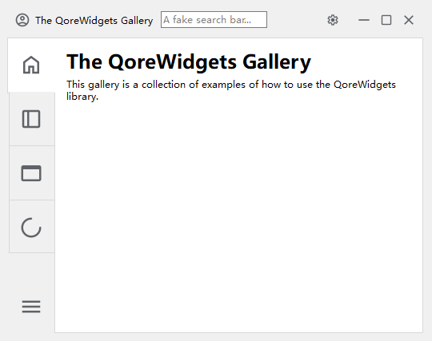
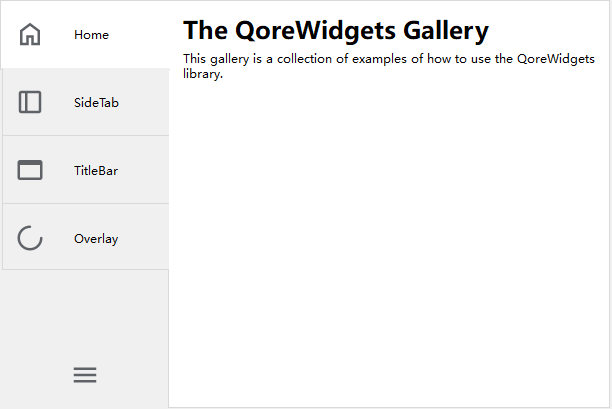
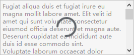

# Qore Widgets


Yet another collection of those core widgets for a modern Qt application.

Backend Support: Currently **only PySide6 is supported.**



## Widget List

| Qore Widget<br>[Base Widget]                          | Desc                                                         | Screenshot                                      |
| ----------------------------------------------------- | ------------------------------------------------------------ | ----------------------------------------------- |
| **SideTabWidget**<br>[TabWidget]                      | A TabWidget with horizontal and foldable tabs. Animated. Support automatic expand on mouse hover. |      |
| **ImmersiveTitleBar**<br>[ImmersiveTitleBarContainer] | A simple immersive title bar with icon, title, and close, maximize, minimize buttons. |           |
| **ImmersiveTitleBarContainer**<br>[QWidget]           | An immersive title bar Container with only  buttons. Put any widgets you like. |  |
| **FramelessWindow**<br>[QMainWindow]                  | A frameless window with resize grips. Better use it with the ImmersiveTitleBar. | /                                               |
| **LoadingOverlay**<br>[QWidget]                       | Create a mask on the targeted widget with a rotating icon during long time tasks |              |
| **EmptyOverlay**<br>[QWidget]                         | Automatically show/hide a empty indicator mask on the target item view/widget when it's empty or not |                                                 |
| **ImmersiveMesageBox** <br>[QMessageBox]              | (todo)                                                       |                                                 |
| **DrawerWidget**                                      | (todo)                                                       |                                                 |


## Installation

```bash
pip install qorewidgets
```

## Usage

There are two ways to integrate QoreWidgets into your project:

### Programmatically

Most Qore Widgets are designed as drop-in replacements for their corresponding base widgets.

### With Qt Designer

Tip: If you installed PySide6 using pip, the designer is also installed as `pyside6-designer` executable.

1. Create the base widget in Qt Designer
2. Right-click on the widget and select "Promote To..."
3. Enter the desired Qore Widget name  as the **promoted class name**, and "QoreWidgets.h" as the **header file**
4. Use the `pyside6-uic` tool (also installed with PySide6) to convert the .ui file to a .py file
5. the base widget will be replaced by the appropriate Qore Widget during the conversion

Refer to [Qt Doc: using custom widgets in designer](https://doc.qt.io/qt-6/designer-using-custom-widgets.html) for more detailed instructions. 

### Documentation

For more infomation, check out the [QoreWidgets Documentation](https://github.com/du33169/QoreWidgets/wiki).


## Examples

The QoreWidgets Gallery app provides examples about how to use these widgets. To run the gallery app:

```bash
git clone https://github.com/du33169/QoreWidgets
cd QoreWidgets
pip install PySide6
python gallery/app.py
```

Note: the gallery app will first attempt to import QoreWidgets from installed python packages. If not installed, it will then import from the local  `src` directory.

## Styling

QoreWidgets mainly focus on functional enhancements with minimal decoration. However, they should fit in with your global theme or stylesheets, for example, [PyQtDarkTheme](https://github.com/5yutan5/PyQtDarkTheme).
